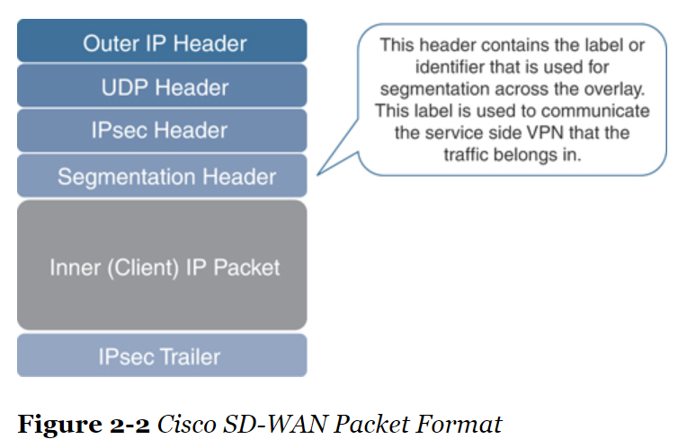
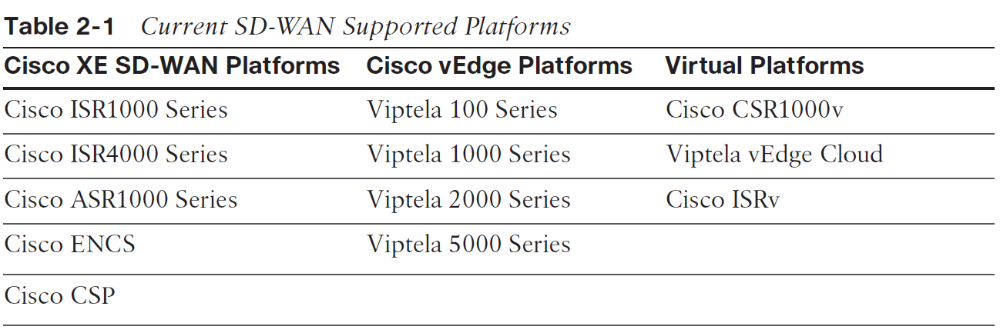
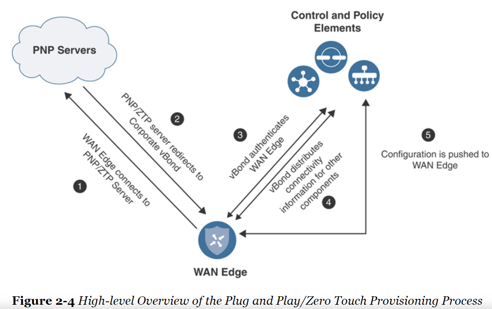
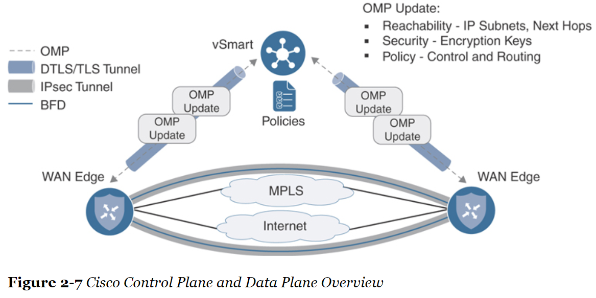
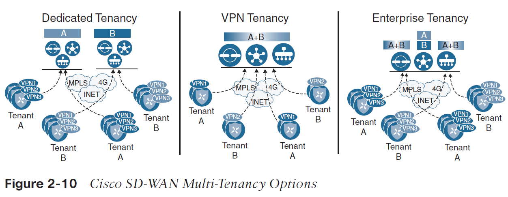

## Introduction
- Cisco SD-WAN separates the data plane, control plane and management plane from each other.
- The controller has complete view of the network
  - it will calculate the routing table only once and distribute this to all WAN Edge routers.
  - it can create a common network policy across the entire SD-WAN fabric.

## Data Plane
- WAN Edges: could be vEdge routers or XE SD-WAN routers.
- Data plane devices are deployed at branches, data centers, large campuses, colocation facilities, or in the cloud. 
Each site can have a single WAN Edge or multiple WAN Edges.
- Data plane connections are only between data plane devices, secured with IPsec tunnels.
  - Have native segmentation
- SD-WAN header

- Cisco SD-WAN support diverse topologies, per-VPN topology.
  - Each VPN segment is isolated from communicating with each other unless policy allows it.
  - Each VPN is carried in a single IPsec tunnel.

- On the LAN, or service side, data plane supports OSPF, EIGRP or BGP for routing protocols; or VRRP (when do not ultilize routing)

- Bidirectional Forwarding Detection (BFD) is used inside IPsec tunnels between all WAN Edges.
  - BFD sends Hello messages to measure link liveness, packet loss, jitter, delay.
  - BFD operates in echo mode: neigbor does not participate in processing BFD packet, simply echoed back.
  - BFD can not be turned off.

- WAN Edge onboarding:
  - First, connect to Plug and Play (PNP) or ZTP server
  - Connect to orchestration plane to learn about other components
  - Establish BFD connection to all other WAN Edges; full-mesh by default.
  - it attempts to build control connections across each transport. By default, if a transport doesn’t have control
  connectivity to any of the Cisco SD-WAN controllers, then it won’t build a data plane connection across that transport either.

- WAN Edges can be physical or virtual:
  - Physical: Cisco Integrated Services Router (ISR), Cisco Advanced Services Router (ASR), and Cisco vEdges.
  - Virtual: Cisco Cloud Services Router (CSR1000v) running XE SD-WAN and Cisco vEdge Cloud.
  - Virtual can be deployed on public, private clouds; or at branch via Cisco Enterprise Network Compute System (ENCS)
  and Cisco Cloud Services Platform (CSP).

- Choosing WAN Edge: throughput requirement, data plane tunnel requirement, type of interfaces requirement.
  - Cisco vEdge platforms support Ethernet, LTE, and wireless interfaces
  - Cisco XE SD-WAN platforms support additional voice and serial interfaces

- WAN Edges have built-in security:
  - WAN-facing interfaces allow only IPsec connections from authenticated sources.
  - Allows Direct Internet Access (DIA)
    - Reduced bandwidth requirements and latency on costly WAN circuits
    - Guest access
    - Improved user experience to Cloud SAAS and IAAS applications

## Management Plane

- vManage provides a single pane of glass to manage the SD-WAN solution: onboarding, provisioning, policy creation,
software management, trouble shooting and monitoring.
- Can interact with vManage using API, REST and NETCONF.
- vManage is clustered, with multiple clusters deployed regionally or globally.
  - a single cluster consists of three or more but must be odd number
  - A cluster can manage up to 6000 WAN Edges, each vManage handling 2000 WAN Edges.
- All configuration should be performed within vManage to maintain consistency and scalability.
- vManage can be used for troubleshooting and monitoring:
  - simulate traffic flows to show data paths, troubleshoot WAN impairment
- Each WAN forms only one management plane connection to vManage, even multiple transports are available.
- vAnalytics:
  - collect data from network and use ML to predict trends on capacity.

## Control Plane

- vSmart is the brain of SD-WAN fabric.
  - responsible for implementation of control plane policies, centralized data policies, service chaining,
  VPN topologies, security and encryption.
  - has complete view of the network, calculate routing information and distribute to all WAN Edges.
  - uses Overlay Management Protocol (OMP) for communicating all information inside DTLS/TLS tunnel.
  -  receives policy from vManage via NETCONF and distribute this policy to the WAN Edges via OMP Update.

- vSmart operates similarly as BGP route reflector in iBGP.
  - receive routing info from each WAN Edge
  - apply policy and advertise back to WAN Edge

- vSmart provide key management:
  - Each WAN edge compute its own key per transport and distribute these to vSmart
  - vSmart distribute keys to each WAN Edge
  - rekeying IPsec Security Association (SA) when expired

- When control connectivity is lost:
  - By default, WAN Edges continue forwarding data plane traffic for 12 hours.

- When control connectivity is restored:
  - WAN Edges will be updated with any policy changes
  - Route table will be flushed and new route table is installed.

- At least two vSmarts for redundancy with identical configuration.
  - maintain full-mesh OMP sessions among themselves
  - exchange control and routing information
  - control connections from WAN Edges will be load balanced

## Orchestration Plane

- vBond is reponsible for:
  - Providing initial authentication for participation on the fabric
  - Acting as the glue that discovers and brings all other components together

- Multiple vBonds can be deployed for high availability:
  - WAN Edge can point to only a single vBond
  - Recommend use DNS and have a single A record points to all vBond IPs; try to connect each one sequentially

- When WAN Edge first joins
  - it knows only the vBond through: PNP, ZTP, Boostrap configuration, Manual configuration.
  - attempts to build a temporary connection to vBond over each transport
    - each component authenticates each other
    - a Datagram Transport Layer Security (DTLS) tunnel is established
    - vBond distributes connectivity information for the vSmart and vManage to the WAN Edge
  - this connection will be torn down when control plane connectivity is up to vManage, vSmart

- vBond provides Network Address Transaltion (NAT) traversal.
  - VBond operates as STUN Server
  - WAN Edge operates as STUN Client

- vBond can detect when WAN Edges are behind a NET device such as a firewall
- vBond must be publicly addressable, though this could be via 1:1 static NAT

## Multi-tenancy Options

- Cisco SD-WAN supports multiple modes of segmentation:
  - Dedicated tenancy: each tenant has dedicated components and the data plane is segmented as well.
  - VPN tenancy: segments only the data plane of the VPN topology, define read-only user to view and monitor their
  VPN within vManage.
  - Enterprise tenancy: orchestration and management planes are operating in multi-tenancy mode, control plane is
  dedicated, per-tenant.

## Deployment Options

- Multiple deployment options are supported:
  - Using Cisco Cloud: Cisco builds all SD-WAN components.
  - Private Cloud: Cisco SD-WAN controllers are deployed in different clouds: Amazon AWS, Microsoft Azure.
  - On-premises: Cisco SD-WAN controllers are deployed in traditional data center.