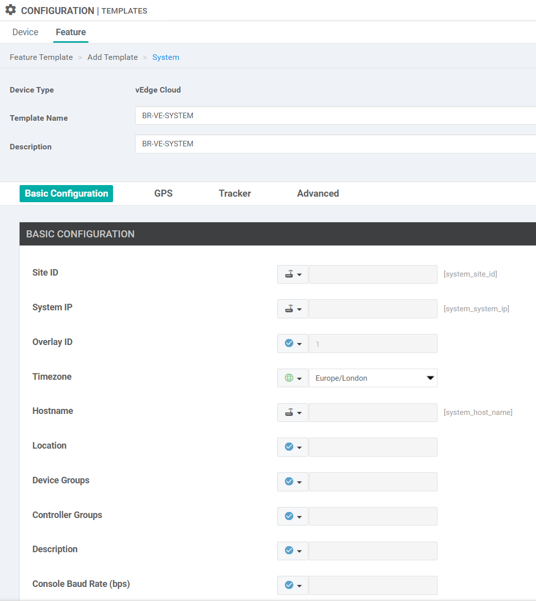

## 1. Create Feature Template
Before starting create template, it is very important to plan the template name properly. We need to come up with
 a meaningful way to name the template that is suitable for the intent use of the template.
- Naming convention: 
  - System template for vEdge Cloud at a Branch: BR-VE-SYSTEM
  - VPN template for vEdge Cloud at a Branch: BR-VE-VPN-VPN0

When we create a template, for each parameter we have three types of setting as follows:
- Global: Apply to all devices using this template.
- Device specific: when apply template, we will need to specify this parameter.
- Default:
### Create System Template
We create the first `BR-VE-SYSTEM` template as in the following figure.

### Create VPN0 Template
Basic configuration:

IPv4 Route configuration:

### Create VPN Interface Ethernet BR-VE-VPNINT-VPN0-G0
Basic configuration:

Tunnel configuration:
- Turn on tunnel interface.
- Select color as `mpls`.

