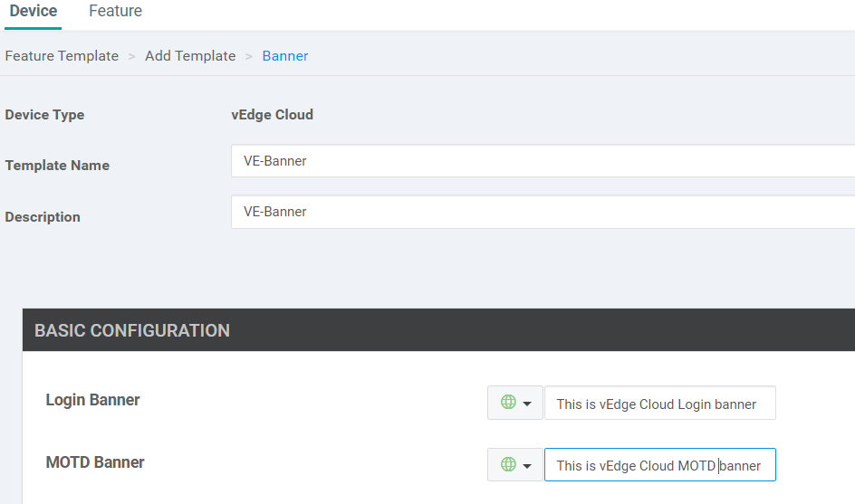
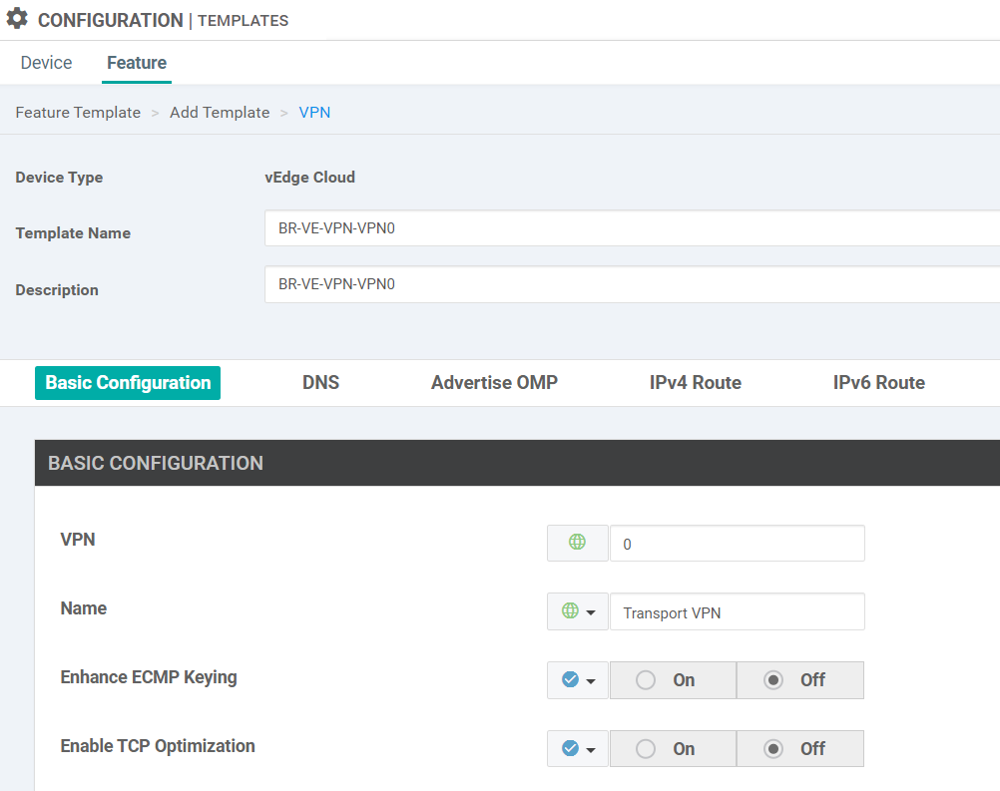
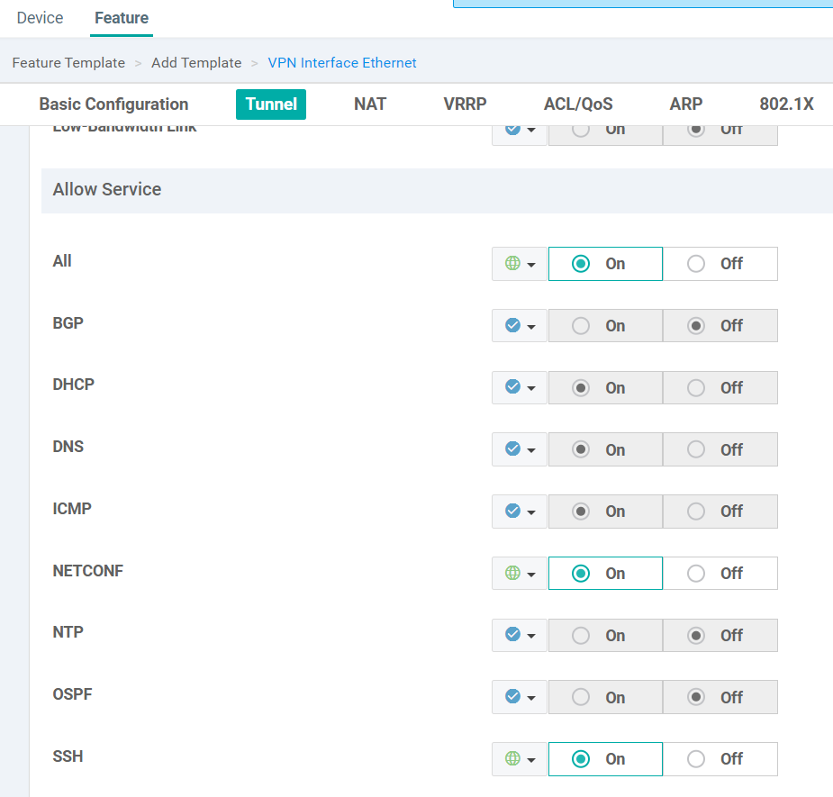
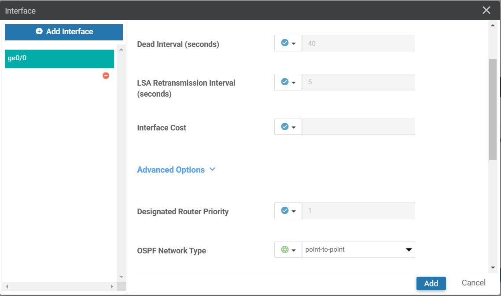
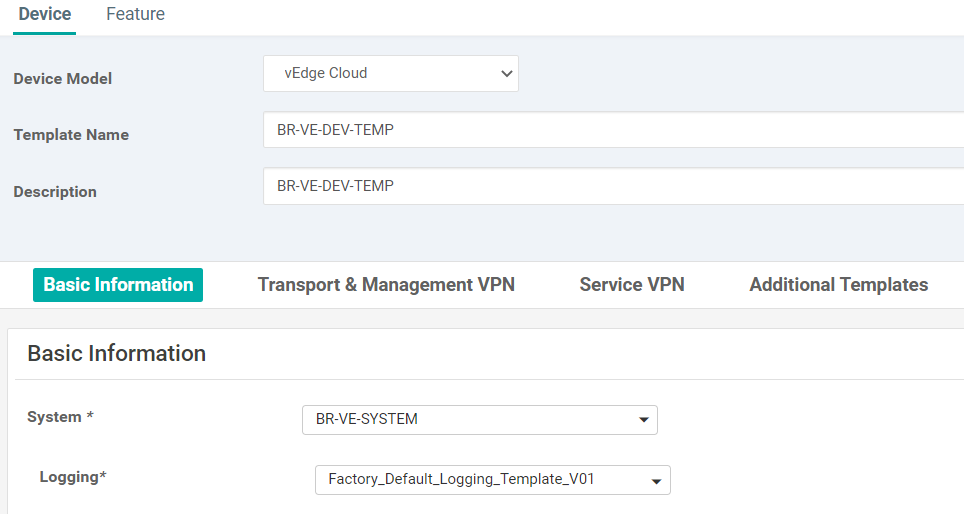
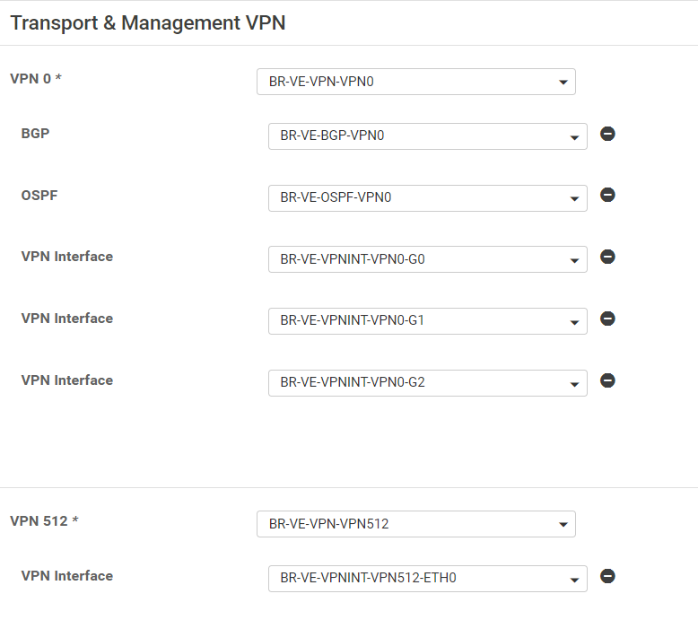
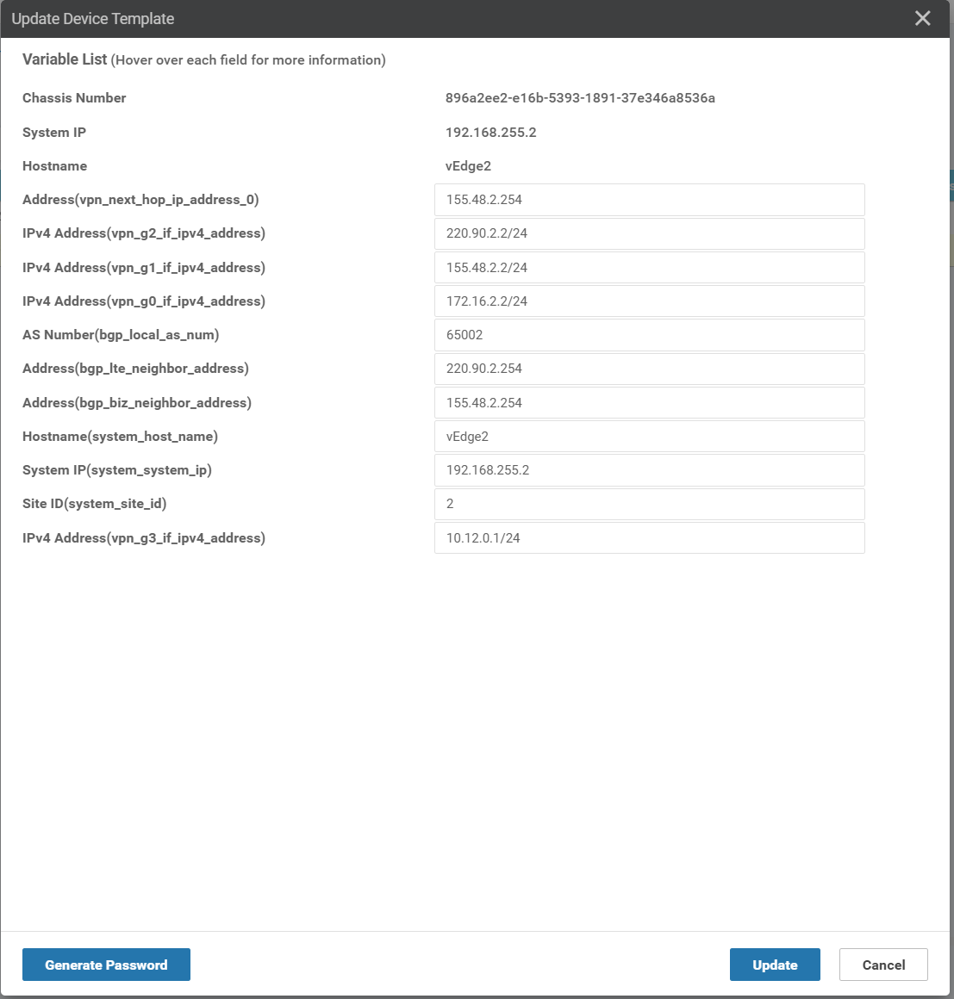

## 1. Create Feature Template
Before starting create template, it is very important to plan the template name properly. We need to come up with
 a meaningful way to name the template that is suitable for the intent use of the template.
- Naming convention: 
  - System template for vEdge Cloud at a Branch: BR-VE-SYSTEM
  - VPN template for vEdge Cloud at a Branch: BR-VE-VPN-VPN0

When we create a template, for each parameter we have three types of setting as follows:
- Global: Apply to all devices using this template.
- Device specific: when apply template, we will need to specify this parameter.
- Default:

### 1.1. Create System Template

- Template Name: BR-VE-SYSTEM
- Site ID: Device Specific
- System IP:  Device Specific
- Hostname: Device Specific
- Timezone: Global: Europe/London
- Console Baud Rate: Default

We create the first `BR-VE-SYSTEM` template as in the following figure.

### 1.2. Create VE-banner
- Template name: VE-banner
- Description: VE-banner
- Login banner: Global "This is vEdge Cloud Login banner"
- MOTD banner: Global "This is vEdge Cloud MOTD banner"

### 1.2. Create VPN Template
#### Create VPN0 Template

- Template Name: BR-VE-VPN-VPN0
- Description: BR-VE-VPN-VPN0
- Basic configuration: 
  - VPN: Global: 0
  - Name: Global: Transport VPN

- IPv4 Route Configuration:
- Prefix: Global: Default
- Next Hop: Device Specific
  - Key Value: vpn0_g0_next_hop_ip_address_0

#### Create VPN512 Template
Copy from VPN0, change the following fields:
- VPN: Global: 512
- Name: Global: Management VPN
- Delete Ipv4 route

### 1.3. Create VPN Interface Ethernet 
#### Create BR-VE-VPNINT-VPN0-G0
Basic configuration:

Tunnel configuration:
- Turn on tunnel interface.
- Select color as `mpls`.
- Allow service: `All`, `NETCONF`, `SSH`

#### Create BR-VE-VPNINT-VPN0-G1
Copy from BR-VE-VPNINT-VPN0-G0, only change the following fields:
- Interface name: 'ge0/1'
- Description: `Transport MPLS`
- Select color as `biz-internet`

#### Create BR-VE-VPNINT-VPN0-G2
Copy from BR-VE-VPNINT-VPN0-G0, only change the following fields:
- Interface name: 'ge0/2'
- Description: `Transport LTE`
- Select color as `lte`

#### Create BR-VE-VPNINT-VPN512-ETH0
- Template name: BR-VE-VPNINT-VPN512-ETH0
- Description: BR-VE-VPNINT-VPN512-ETH0
- Interface name: Global eth0
- IPv4: Dynamic

### 1.4. Create routing feature template

#### Create OSPF Template
- Template name: BR-VE-OSPF-VPN0
- Description: BR-VE-OSPF-VPN0
- Router ID: Default
- Area number: Global: 0
- Add interface: 
  - Interface name: Global ge0/0
  - Advanced options: OSPF network type: Global point-to-point

#### Create BGP Template
**BR-VE-BGP-VPN0**
- Template Name: BR-VE-BGP-VPN0
- Basic Configuration
  - Shutdown: Global: No
  - AS Number: Device Specific
    - Key Value: bgp_local_as_num
- Adding Neighbor to LTE transport
  - Address: Device Specific
  - Key Value: bgp_lte_neighbor_address
  - Remote AS: Global: 300
  - Address Family: Global: On
  - Address Family: Global: IPv4-Unicast
- Adding Neighbor to biz-internet transport
  - Address: Device Specific
  - Key Value: bgp_biz_neighbor_address
  - Remote AS: Global: 155
  - Address Family: Global: On
  - Address Family: Global: IPv4-Unicast

## 2. Create Device Template
### 2.1. BR-VE-DEV-TEMP

- Template Name: BR-VE-DEV-TEMP
- Description: BR-VE-DEV-TEMP
- Basic Information
  - System: BR-VE-SYSTEM

- Transport and Management VPN
  - VPN 0: BR-VE-VPN-VPN0
    - BGP: BR-VE-BGP-VPN0
    - OSPF: BR-VE-OSPF-VPN0
    - VPN Interface:
      - BR-VE-VPNINT-VPN0-G0
      - BR-VE-VPNINT-VPN0-G1
      - BR-VE-VPNINT-VPN0-G2
  - VPN 512: BR-VE-VPN-VPN512
    - VPN Interface:
      - BR-VE-VPNINT-VPN512-ETH0

- Additional Templates:
  - Banner: VE-Banner

### 2.2. Attach device template to WAN Edges

#### Attach BR-VE-DEV-TEMP to vEdge1
- Use the addressing scheme in the topology to fill in the variables when apply the device template.

- Attach vEdge1

- Attach vEdge2

